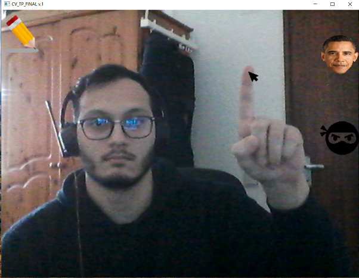
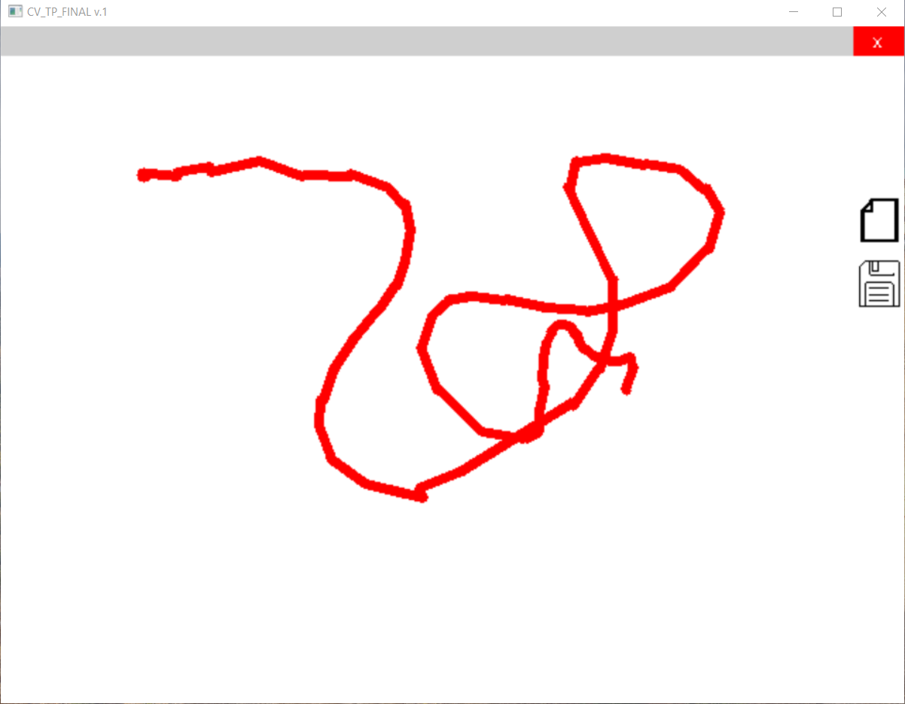
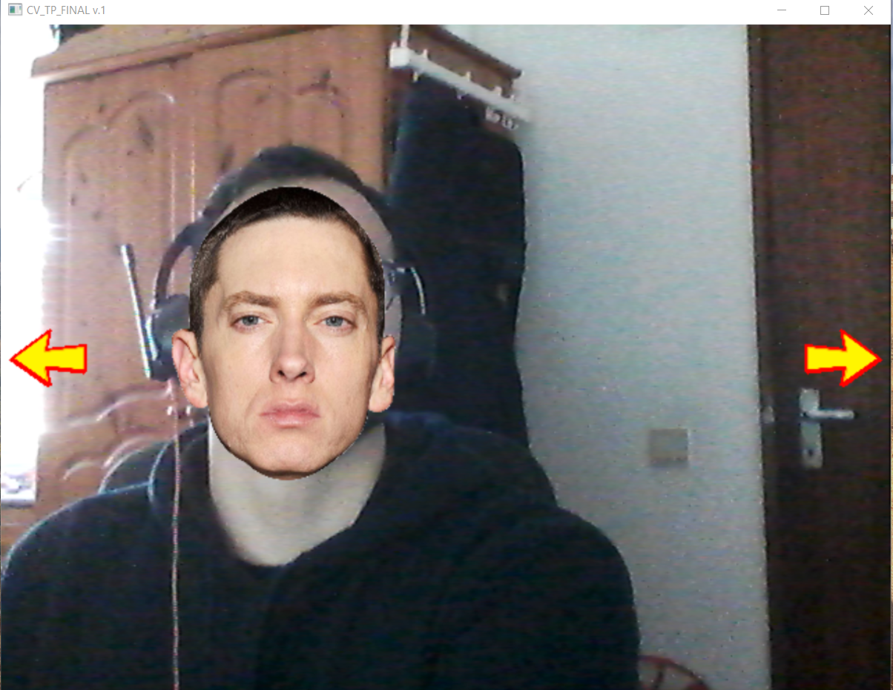
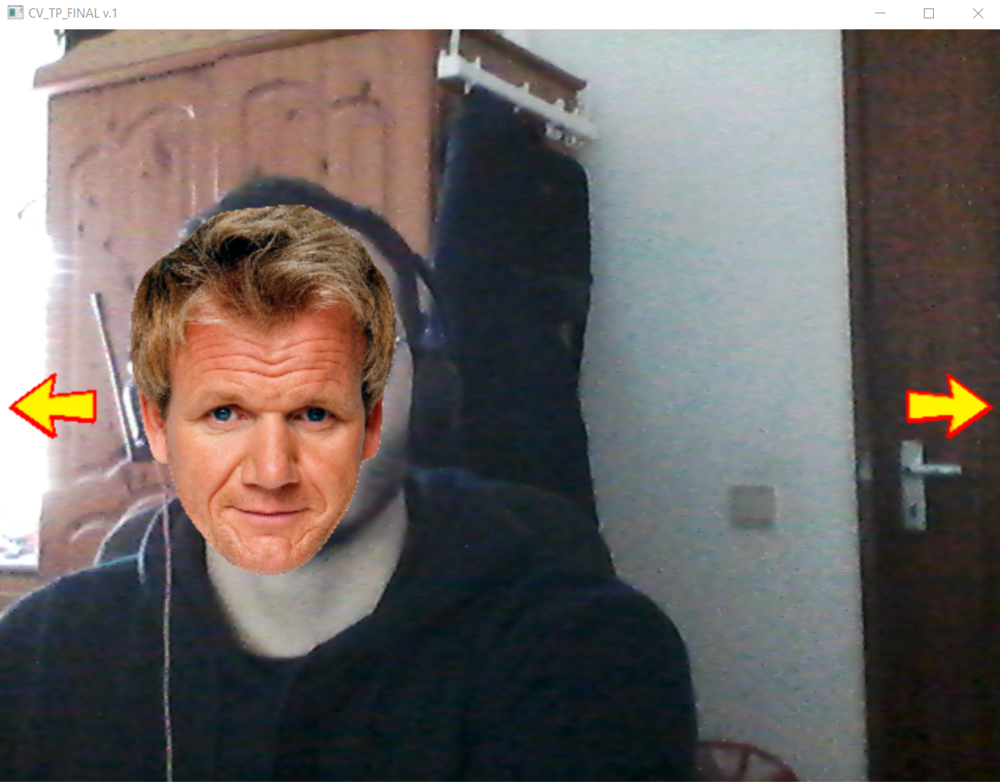
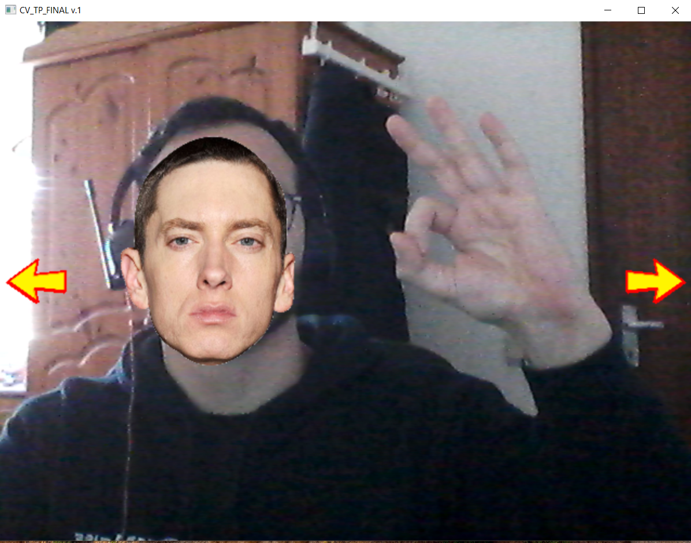
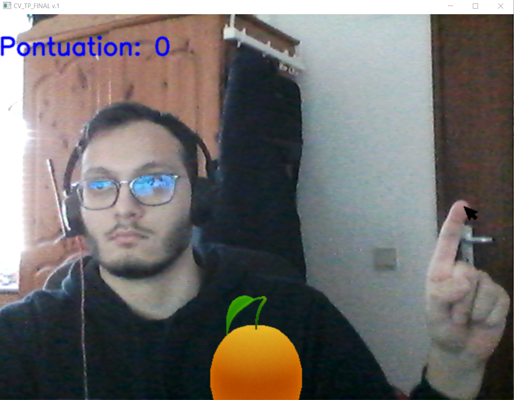

# VisualDesktop

**VisualDesktop** is a Python-based project that uses OpenCV and MediaPipe to create a futuristic desktop experience.

It allows users to control applications by interacting with icons on the screen using hand gestures detected by the camera. By tracking finger positions, users can perform various actions without needing a physical mouse or keyboard.

## Installation

1. Clone the repository:
    ```sh
    git clone https://github.com/your-username/VisualDesktop.git
    ```

2. Navigate to the project directory:
    ```sh
    cd VisualDesktop/app
    ```

3. Install required libraries:
    ```sh
    pip install -r requirements.txt
    ```

4. Run the main script:
    ```sh
    python main.py
    ```

## Usage

VisualDesktop will open a window displaying the camera feed. Users can interact with the applications by using their index finger in front of the camera. To select the desired application, simply hover over the corresponding icons.

Example:



### Applications and Gestures

- **Draw**: Allows users to draw on the screen using their fingers.
    - Two fingers: Draw
    - All fingers: Erase
    - Index finger on empty file icon: Reset the whiteboard
    - Index finger on memory card icon: Save
    - Index finger on close icon: Close the Draw application
    - Example:
    

- **Face Replace**: Replaces the user's face with a famous face.
    - Index finger on arrows icons: Change the face
    - Example:
    
    
    - To close the application, make a circular gesture with your fingers as shown below:
    

- **Catch Orange Game**: A game where the user has to catch falling oranges.
    - Open your hand and close it to catch the orange
    - Example:
    
    - Each catch will increase the score